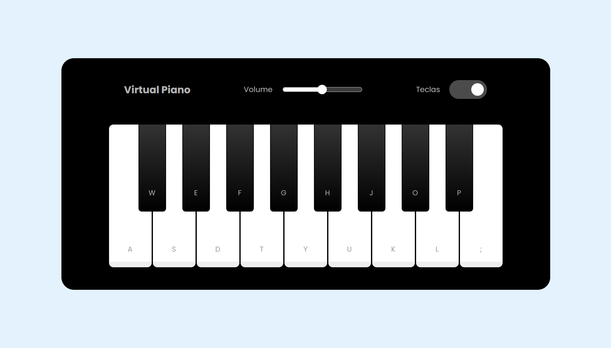
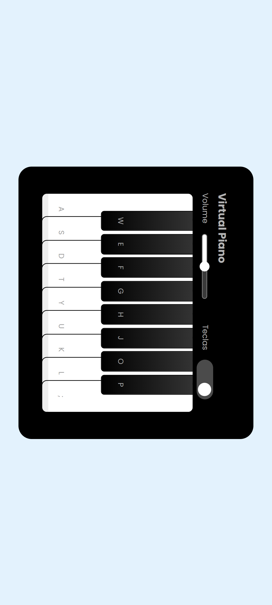

# SIMULADOR DE PIANO VIRTUAL

Projeto desenvolvido como desafio de projeto do Bootcamp iFood - Desenvolvimento de Jogos da DIO.
Consiste em um piano virtual.

    

Com versão mobile: 

    

### Tecnologias utilizadas
HTML
CSS
JavaScript

### Créditos 
Projeto base desenvolvido por [Felipe Aguiar](https://github.com/felipeAguiarCode/js-music-keyboard-virtual)